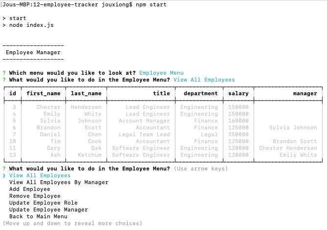
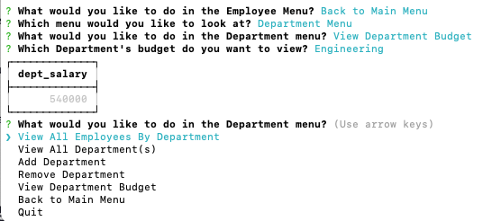
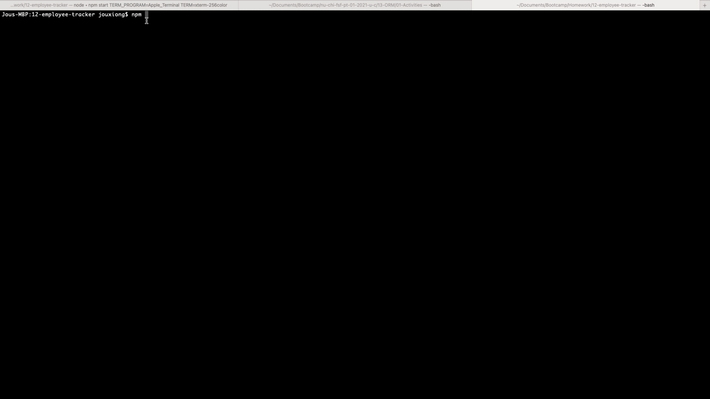
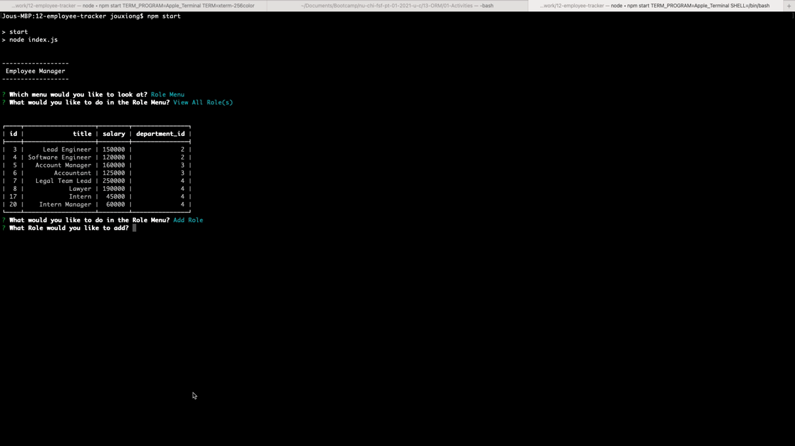
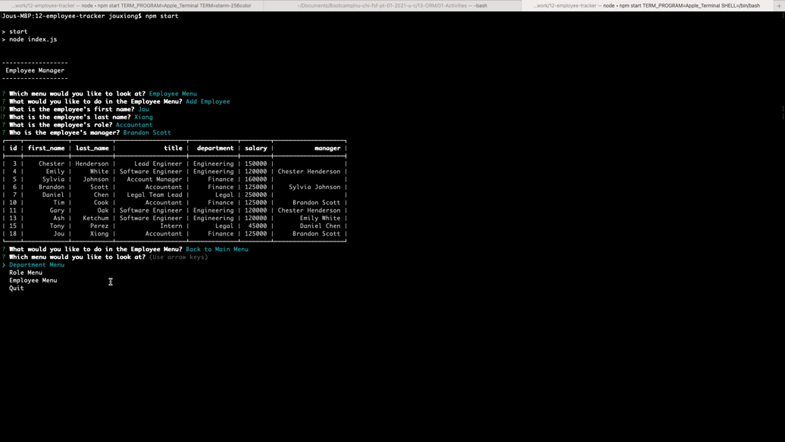
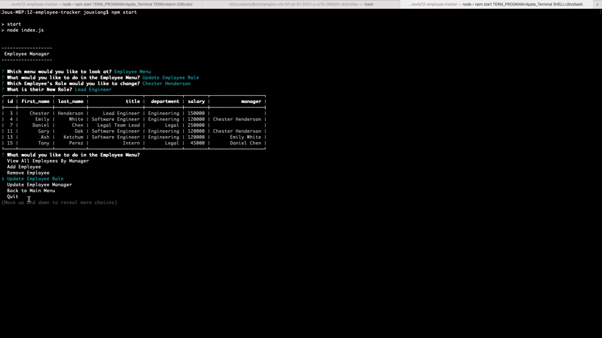

# Unit 12 MySQL Homework: Employee Tracker
[](https://opensource.org/licenses/MIT)


## Table of Contents
* [Introduction](#introduction)
* [Functionality](#functionality)
* [Tasks Completed](#tasks-completed)
* [Technologies Used](#technologies-used)
* [Installations](#installations)
* [Demos](#demos)
* [Future Ideas](#future-ideas)
* [Sources](#sources)
* [License](#license)


 ## Introduction
 Uses Node, Inquier, MySql, and the command line to generate an employee database. The database displays departments, roles, and individual employee information.
 * GitHub Repository: https://github.com/JXIong15/12-employee-tracker
 * [App Demonstration:](https://drive.google.com/file/d/1nho_JsT15NoVYrZD1V_KKVB-p9wdJvzZ/preview)
<p align="center"></p>


## Functionality
* When the program is initiated, the main menu is displayed. The user has a choice of viewing the Departments, Roles, or Employees Menus.
* In the Departments Menu, the user can view employees in each department, view all departments, add departments, remove departments, and view each department's budget.
  * When a Department is deleted, the roles and employees in that department are also deleted.
  * The budget is the amount spent on employee salaries in that department.
* In the Roles Menu, the user can view all roles, add roles, and delete roles.
  * When a role is deleted, the employees for that role are also deleted.
* In the Employees Menu, all employees can be viewed, employees can be viewed by manager, employees can be added and removed, and employee information can be updated. 
  * The information that can be updated are the Employee's role and Manager.
* If the user wants preput information to test the app, they can run:
```
mysql -h HOSTNAME -u USER DATABASE < ./db/schema.sql
mysql -h HOSTNAME -u USER DATABASE < ./db/seeds.sql
```


## Tasks Completed
* Dowloaded necessary NPM packages. View [Installations](#installations) below for exact packages.
* Created a connection between the database and server using MySql.
* Use Util to promisfy query information from the server.
* Created 2 `.sql` files
  * One is to create the database
  * Second is to input information to test the app
* Created a database class to construct a connection to the server.
  * created functions which return the desired query information from the server
* Used `Inquirer` to interact with what the user wants to do.
* Used switch statements in the menus.
* Created array functions which call on the connections file to the server. The function checks there are values in the array before mapping it accordingly to be returned as an array of desired information rahter than just a `PRIMARY KEY ID`.
  * Used the `SELECT * FROM` method to obtain all information from the database pertaining to the desired array data.
* To view desired information, `async-await` functions wait for the connection to send back the data from the database. This is then printed out in a table.
  * On the server side, the various tables are joined through `SELECT`, `JOIN`, and `LEFT JOIN` properties.
    * To view employees by Department or Manager, an extra comparison factor is used to ensure the information is the user-specified one.
* To add new information, the user-input data is passed to the database by the `INSERT INTO [table_name] SET ?` method with the data.
* To remove desired information, the `DELETE FROM [table_name]` is used where the `id` is equal to the ID of the user-specified object to be deleted.
* To calculate the Department Budget, the `SUM` method is used to add the total salary from the roles of each employee in that desired department.
* To update employee information, the `UPDATE` and `SET` methods change the information where specified.

<p align="center"></p>
<p align="center">Engineering Department Budget Example</p>


## Installations
* Download NPM and packages:
  * Inquirer (npm install inquirer)
  * Node (npm install node)
  * Dotenv (npm install dotenv)
  * Express (npm install express)
  * MySql (npm install mysql)
  * Console Table Printer (npm install console-printer-table)
    * could also use Console Table (npm install console-table)


## Technologies Used
* JavaScript
* NPM Packages
* Terminal/Command Line (to interact with the questions)
* MySql Workbench
  * Query Conenection
* MySql Server


## Demos
Whole App Demo: https://drive.google.com/file/d/1nho_JsT15NoVYrZD1V_KKVB-p9wdJvzZ/preview

* Menu Demo:
   <p align="center"></p>

* Adding Role Demo:
   <p align="center"></p>

* Removing Department Demo:
   <p align="center"></p>

* Editing Employee Demo:
   <p align="center"></p>


## Future Ideas
* Allow new employees to not have a manager
* Make sure people cannot be their own managers
* Prevent people from being managed by those outside of their department
* Separate the sub-menus into their own JS files.
  * Couldn't do this due to "circular reasoning"
* Edits to more Employee and Role information
* Better header/title page


## Sources
* NPM Packages: https://www.npmjs.com/
* MySql Workbench: https://www.mysql.com/products/workbench/
* MySql Server: https://dev.mysql.com/downloads/mysql/


## License
Licensed under the [MIT License](LICENSE).

<p align="center">© 2021 Jou Xiong, Trilogy, Northwestern Coding Bootcamp</p>
